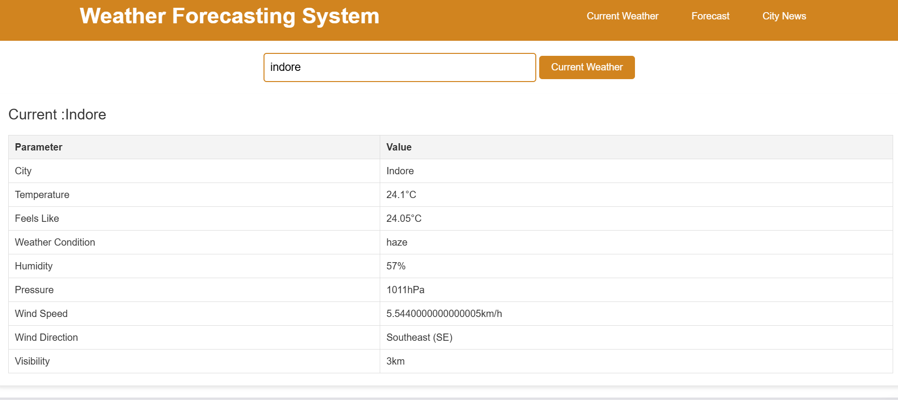

# 🌤️ Weather Forecasting System

A **Weather Forecasting System** built using the **OpenWeather API** that provides **current weather details** and a **5-day weather forecast** for a given city. Stay tuned for **city-specific news** coming soon! 🌎🌧️☀️

---

## 🚀 Features:
- 🌡️ **Current weather data** (temperature, humidity, wind speed, and more!)
- 🌤️ **5-day weather forecast** to help you plan ahead
- 📰 **City-specific news** (coming soon!)

---

## 📷 Screenshots

Here’s what the Weather Forecasting System looks like:



---

## 💻 Technologies:
- **Frontend**: HTML, CSS, JavaScript
- **API Used**: OpenWeather API (provides weather data)
- **Other**: Real-time weather updates based on city name

---

## 🚀 Usage:

To use this Weather Forecasting System:

1. **Enter a city name** in the search bar at the top of the page.
2. **Click on "Current Weather"** to view the current weather details for your city (temperature, humidity, wind speed, and more).
3. **Click on "Forecast"** to see a **5-day weather forecast** for the city.

---

## 🛠️ Installation:

To run this project locally, follow these steps:

1. Clone the repository:
   ```bash
   git clone https://github.com/PRATIKSINDHIYA/weather-forecasting-system.git
   ```

2. Navigate to the project directory:
   ```bash
   cd weather-forecasting-system
   ```

3. Open `index.html` in your browser or use a local server.

---

## 📝 License:

This project is licensed under the **MIT License** - see the [LICENSE](LICENSE) file for details.

---

## 🙏 Acknowledgments:
- 💡 **OpenWeather API** for providing real-time weather data and forecasts.
- 🎨 **Flaticon** for the icons used in this project.
- 💻 Special thanks to all contributors who made this project possible.

---

## 📧 Contact:

If you have any questions or suggestions, feel free to reach out:

- GitHub: [PRATIKSINDHIYA](https://github.com/PRATIKSINDHIYA)
- Email: [pratiksindhiya3@gmail.com](mailto:pratiksindhiya3@gmail.com)

---

## 🔗 Links:

- [Weather Forecasting System GitHub Repository](https://github.com/PRATIKSINDHIYA/weather-forecasting-system)

---

